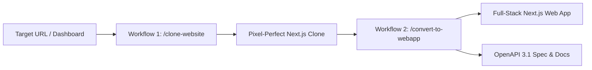

<div align="center">

# AI Website Cloner & WebApp Appification Platform

### Clone any website into a pixel-perfect Next.js replica, and convert it into a production-grade Web App with OpenAPI 3.1 specs

Give your AI coding agent a URL and watch it recreate the website as a clean Next.js app, or appify any cloned frontend into a full-stack application with live API Route Handlers and OpenAPI contracts.

**Best results with [Antigravity CLI (AGY)](https://antigravity.google) and [Claude Code](https://docs.anthropic.com/en/docs/claude-code) + Opus 5. Works with Codex, Cursor, Gemini, and more.**

[](https://github.com/JCodesMore/ai-website-clone-template/generate) [](https://discord.gg/hrTSX5yTpB)

[Quick Start](#quick-start) · [Dual Workflows](#dual-workflows) · [OpenAPI Specs](#openapi-specification) · [Antigravity Plugin](#antigravity-agy-plugin-quickstart)

</div>

---

## ⚡ Dual Workflows

This plugin provides two complementary workflows:



### 1. `/clone-website <url>` — Pixel-Perfect Reverse-Engineering
- Extracts design tokens, fonts, spacing, computed CSS, and responsive layouts.
- Interactive authentication & session handoff for gated user dashboards (`npm run clone:login`).
- Parallel worktree builder agents dispatch for zero-conflict component construction.

### 2. `/convert-to-webapp` — Appification & OpenAPI Generator
- Reverse-engineers data models, table columns, form inputs, and state transitions.
- Emits standard **OpenAPI 3.1 (OAS 3.1)** specifications (`docs/api/openapi.json`).
- Mounts interactive API documentation & Swagger explorer at `/api/docs`.
- Generates **Zod-validated Next.js Route Handlers** (`src/app/api/.../route.ts`).
- Wires client components and forms to live backend endpoints.

---

## 🚀 1-Command Instant Initializers

You can initialize a brand-new cloning workspace anywhere with a single command:

#### macOS / Linux / Git Bash (cURL):
```bash
curl -fsSL https://raw.githubusercontent.com/TheophilusChinomona/website-cloner-platform/master/scripts/init.sh | bash -s -- my-new-site https://example.com
```

#### Windows PowerShell:
```powershell
irm https://raw.githubusercontent.com/TheophilusChinomona/website-cloner-platform/master/scripts/init.ps1 | iex
```

#### Local CLI Runner:
```bash
npm run init:clone my-new-site -- --url https://example.com
```

---

## ⚡ Quick Start & Development
   - EdgeTech Solutions: [http://localhost:3000/edgetech](http://localhost:3000/edgetech)
   - Firecrawl Marketing: [http://localhost:3000/firecrawl](http://localhost:3000/firecrawl)
   - Firecrawl Team Dashboard: [http://localhost:3000/app/t/25bMf9wr6oN](http://localhost:3000/app/t/25bMf9wr6oN)

---

## 🧩 Antigravity (AGY) Plugin Quickstart

You can install and use this repository as a global AGY Plugin across any new or existing project:

1. **Register the Plugin Globally**:
   ```bash
   npm run plugin:install:global
   ```
2. **Start Any New Project**:
   ```bash
   mkdir my-new-project && cd my-new-project
   agy
   ```
3. **Run Either Workflow**:
   - To clone a website: `/clone-website https://example.com`
   - To convert into a functional web app: `/convert-to-webapp`

---

## 🛠️ Commands

```bash
npm run dev              # Start development server
npm run build            # Production build
npm run typecheck        # Strict TypeScript check
npm run openapi:generate # Regenerate OpenAPI 3.1 specification (docs/api/openapi.json)
npm run openapi:test     # Run automated API endpoint test suite
npm run clone:login      # Launch interactive login browser session
npm run clone:dashboard  # Crawl authenticated dashboard routes
npm run port:free        # Kill any stale background processes on port 3000
```

---

## 📋 OpenAPI Specification

The generated OpenAPI 3.1 specification is located at:
- File: `docs/api/openapi.json`
- Interactive Web Explorer: [http://localhost:3000/api/docs](http://localhost:3000/api/docs)

Endpoints implemented:
- `POST /api/v1/scrape` — Clean markdown/HTML single-page web scraper
- `POST /api/v1/crawl` — Asynchronous multi-page domain crawler
- `POST /api/v1/map` — Domain URL mapper & discovery engine
- `POST /api/v1/extract` — Structured JSON schema extraction
- `GET /api/v1/keys`, `POST /api/v1/keys`, `DELETE /api/v1/keys` — API key lifecycle manager
- `GET /api/v1/usage` — Live credit quota & request activity log
- `POST /api/v1/contact` — Customer inquiry & quote submission handler

---

## 📜 License

MIT
